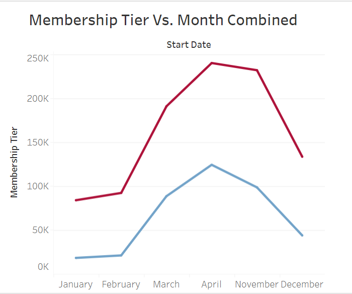

# Case Study: Cyclistic Data Analysis

Cyclistic is a fictional bike-share company that is based in Chicago.
They are asking for ways to grow their user base and turn casual users
into long-term users. It is the job of the analyst to analyze the data
sets given to come up with a market strategize to turn casual riders to
annual riders.

**Questions:**

1.  How do annual members and casual riders use Cyclistic bikes differently?

2.  Why would casual riders buy Cyclistic annual memberships?

3.  How can Cyclistic use digital media to influence casual riders to become members?

<u>**Data Gathering:**</u>

The data that is given are spreadsheets that contain information based
upon rider trip data, the type of user they are, and the stations that
they’ve used. These spreadsheets are separated by month and mostly
contain over a million rows each. There seems to be a lot of missing
data regarding station ids which can make it hard to have it be a focal
point of analysis. I stored the data sets all in the same folder in
order to have an easier frame of reference for analysis.

<u>**The Process:**</u>

Upon loading the spreadsheets, due to the size and volume of the
spreadsheets, it was hard to begin looking and manipulate the data.
Since there were so many rows and the files were so big that I wasn’t
able to get them to load on a spreadsheet software for some of them.
This made me want to go to R to manipulate the data because it’s easier
to use with big data however, due to limitations in software, I was only
able to load 3 sheets and even then I couldn’t do everything I wanted to
without running into more limitations.

This prompted me to try SQL and manipulate my datasets that way. My
thought process was that hopefully I would be able to combine all the
spreadsheets into one and further clean the data. Using SQL, I would be
able to combine as well as take out the columns that I would need. I
tried to consolidate all of my spreadsheets into one project, however
some were too big to upload. I had to make do with data from the end and
beginning of the year which should result in an interesting analysis
still. I utilized two different queries using SQL to create a a table
combining all of the data that was selected then separating that table
into the relevant columns/create columns for the analysis that I needed.
I originally tried to do both of these tasks using one query, however
due to the software that I was using it was proving difficult to
complete that task due to the specifics of that program. Splitting to
two queries made things so much easier and allowed me to do what I
needed to do perfectly. This allowed me to export the data to a csv as
well as saving space. Now the data is consolidated and ready to clean
using Google sheets/Excel or R.


```
   SELECT 
        *
    FROM
        cycling-dataset.cyclistic.April
        UNION ALL(
            SELECT * FROM cycling-dataset.cyclistic.December UNION ALL
            SELECT * FROM cycling-dataset.cyclistic.February UNION ALL
            SELECT * FROM cycling-dataset.cyclistic.January UNION ALL
            SELECT * FROM cycling-dataset.cyclistic.March UNION ALL
            SELECT * FROM cycling-dataset.cyclistic.November
        )
```

<u>**The Data:**</u>

Looking at the data, I wanted to make the data more readable so that it
can help with analyzing. To achieve this I created two columns. One
column was called ride_lenth which shows the projected length that the
rider lasted in minutes. The other column describes the day of the week
that the rider was started on in order to make it easier to see trends
regardless of the date. This was done This was done using sql so that it
makes cleaning better later on.


```
    SELECT
        rideable_type AS bike_type,
        TIMESTAMP_DIFF(ended_at, started_at, MINUTE) AS ride_length,
        CASE
            FORMAT_DATE("%w",started_at)
            WHEN '0' THEN 'Sunday'
            WHEN '1' THEN 'Monday'
            WHEN '2' THEN 'Tuesday'
            WHEN '3' THEN 'Wednesday'
            WHEN '4' THEN 'Thursday'
            WHEN '5' THEN 'Friday'
            WHEN '6' THEN 'Saturday'
        END AS weekday,
        member_casual AS membership_tier
    FROM
        cycling-dataset.cyclistic.cyclistic_complete
    ORDER BY
        ride_length
```


When I proceeded to clean the data, I noticed some inconsistencies in
the ride length column which I sorted through and deleted. There were
cases where the ride length was either negative or zero which would mean
the ride length was either seconds long or there was something wrong
with the start/end times. I made sure there wasn’t any empty cells in
the rest of the columns that I was using as well.

<u>**The Analysis:**</u>

During my analysis I decided to use R to clean and to use various values
and then I switched to tableau in order to turn the data into
visualizations. Utilizing R I was able to find the mean/max ride length,
the most common day, and the number of casuals/members.

The result was as follows:


From the data it suggests that most people tend to like rides that last
from 10 to 20 mins on average and most utilize the service on Tuesdays.
There seems to be twice the number of members as there are casuals but
that doesn’t take into account for members that are using the service
multiple times a month or for multiple months at a time or casuals that
have converted to members.

After this I went on to plot data in tableau to see what trends became
apparent and which conclusions I can make from what the data is showing
me. The first plot that I created compared ride length to week day to
see which days featured riders wanted to ride and for how long.


From the graph, we can conclude that for the most part week days are
very popular for members while casuals like to populate the weekends and
also some of the weekdays. From our data analysis in R, we can see that
Tuesday is indeed a very popular day however Saturday, Sunday, and
Monday are popular days as well with it waning as the work week goes on.
Seems like the longer people have time to ride, the more users there are
for cyclistic.

The next graph that I did was comparing ride length with bike types to
see which bike types had more usability and which bike types appeal to
different user bases.


I found the people used the docked bikes almost 3 times longer than any
other bike types well as it was the one that is almost exclusively used
by casuals. The classic bike had the 2nd longest avg ride time for users
with electric bike being last. Although the bike types seem to have
similar average ride times, it seems like most people tend to prefer
classic or the docked bike over the electric bike for a bit longer
rides. I am guessing this is because the electric bikes have a set
amount of time that they can ride for before they would have to be
charged again. Because of this, they are ideal for short trips less than
20 mins but when it gets longer it can bring about a bit of uncertainty.

The most interesting thing about this visual is how docked bikes are
almost exclusively dominated by casual users. These bikes are based on a
dock system where bikes are checked out and brought to designated
stations for use. This can bring comfort and reliability to casual users
because they know where bikes can be found/returned easily. Despite
being restrictive, that can offer benefits in its own right. Classic
bikes being used by both members and casuals snd more by casuals is no
surprise since it’s the good ol’ tried and true. The downside to the
classic bike is that it’s less secure/reliable since anyone could take
it if they desired.

The next two graphs I made compared the membership tiers to the months
that their rides started on. The first out of the set was the total
casual users per month


This plot shows us that the casual use base started low but
exponentially increased in February and slowed down towards March. It
seems like it peaked sometime in the summer and levels off by the end of
the year.


The graph above displays the total number of members per month for the
beginning and end of the year. The member has a slower ramp but seems to
be a bit more steady in February. It builds in the summer and then
starts decreasing in the winter much like the other graph.



The graph above is comparing the growth rates of the members vs the
casuals in relation to the months available. I can conclude that it
seems to be a near direct relationship between the number of casual
users and the number of users using the service. This is a positive
thing because that means that casuals are starting to convert to members
and are growing up into the summer. Things start to level off into the
winter months and stay steady until it approaches springtime. This does
make sense because most people wouldn’t want to bike in cold weather.
This means in order to increase the number of members using your
service, you would have to capitalize on increasing peaks which would
involve increasing advertising in the spring and summer months. As long
as you are able to appeal to your casual user base, they will end up
turning into members.

The last graph I did involved looking at the average ride length in
accordance to the month it was started in.


This graph tells a similar story that our previous one did. However it
seems to have started a bit higher and then declining in january. Times
increase in February and then stay somewhat steady in march. April seems
to have introduced a decrease in ride times with things kind of becoming
constant by the end of the year. This seems to suggest that Averages
like to be around the 15 minute mark with things going up or down due to
various reasons. As time gets closer to March, more people like to ride
longer and while it continue to level off after that point. This seems
like a good time to increase marketing to capitilize on the increase in
ride length.

<u>**The Plan:**</u>

From our analysis, we know that leading up to springtime and onwards
seems to be the most popular time for cyclistic and also the time people
are riding the most. Casuals, as well as members, undergo a huge
increase during this time which can also mean a there are some casuals
being converted to members, however seeing that they drop off over the
end of the year, it can suggest that they’re not staying as members.
Most members like to ride on the weekdays and casuals tend to populate
the weekdays. The most interesting thing is how casuals and members use
bikes differently as casuals tend to prefer docked bikes and members use
classic and electric types.

The aim of this analysis is to improve the amount of members that
cyclistic has because there is a belief that more money is made from
members rather than casuals. In order to increase the number of casual
users that you attract, you must first appeal and advertise towards
casuals. They like to ride during the weekends, so you can offer
promotions that promote people to trying to use the service on the
weekends. This will attract more users and introduce new people to the
service. A lot of people tend to prefer docked bikes, especially casual
users, so increasing the number of docked stations can have a positive
effect on growth. As mentioned before, advertising in the spring and
summer can help as well since people are more active after staying home
for the colder months. Implementing these changes will help grow the
amount of casuals that you have which in turn will increase the amount
of members since there is a direct relationship there.

However, this only one part of the problem. In order to increase the
amount of members that you have, there needs to be something done about
the amount of people that drop out at the second half of the year. This
can suggest that people are either not renewing their memberships or are
cancelling them for some reason. Even if you increase the amount of
casuals becoming members, you won’t reap many benefits and will end up
in the same place as you were before. There are some plans you could try
to implement to improve retention. One thing that can be done is offer
incentives for staying and continuing the membership. One of these can
be a discount on next years membership if you decide to extend your
current membership by one year. Another way is to reward the user based
on time ridden and number of hours spent riding. This rewards the user
and makes them feel like they’re working towards a goal, thus increasing
thelikelihood they stick around to reap even better rewards. You can
even suggest to offer discounts on other services by being a member for
X amount of time to promote retention. Another suggestion can be to
offer unlimited riding time to members and not to casuals since casuals
are more likely to ride bikes for a longer period of time.

<u>**Questions and Answer:**</u>

1.  How do annual members and casual riders use Cyclistic bikes differently?

We can answer this question by looking at the average ride time per bike
graphic. The graphic shows that casuals users tend to prefer to ride the
docked bikes for longer while the classics and electric model tend to
get left behind. Members seem to like to use classic/electric models and
ride for a shorter amount of time. Members like to use the service on
weekdays meanwhile casual users use the service mostly on weekends.

2.  Why would casual riders buy Cyclistic annual memberships?

This is a good questions and it expands on the primary reason of why
this analysis was done. One reason why cyclistic riders buy annual
memberships might be because the price difference makes sense to them.
Another reason is that they are able to take advantage of benefits that
a annual membership offers them more than just staying a casual. Commute
might be easier on bikes which allows people to save money while still
having reliable transportation. This can be very enticing as gas prices
have been on the rise last year as well as the car market being inflated
for the majority of 2022

3.  How can Cyclistic use digital media to influence casual riders to become members?

Cyclcistic can capitilize on the time leading to months where they are
popular to launch an ad campaign to promote their product and get as
many eyes on it as possible. There seems to be a trend of users ramping
up durin the spring and summer time and then tapering off on the colder
months. This means to increase the amount of members you must advertise
during the spring/summer where interest is the highest in riding. This
is shown in my membership tier vs. month graphic. Many people like to
get out and ride on the weekends during the spring/summer, so appealing
to their sensibilities can provide for a pretty big boost to the casual
user base. You can even provide unlimited ride time for members to
increase the amount of casual riders becoming members since casuals tend
to ride for longer periods of time. Tuesdays can be a good day to focus
on since it’s the day there are the most riders.

<u>**Conclusion:**</u>

From our analysis we can conclude that in order to increase the amount
of annual members for cyclistic, we need to focus on growing the amount
of casual users we have while increasing the retention rates of our
current members. Focusing only on getting casuals to become members is
not going to help in the long run if they keep leaving. This can be
achieved through offering incentives for staying a member and offering
benefits for longer ride time since casual users, on average, ride
longer than annual members do. Many casuals are weekend riders and
annual members seem to enjoy riding on weekdays for the most part, so
incorporating help for both can help the best of both worlds and improve
the rider experience. As long as the user is happy they will continue to
ride and might even be able to make a good profit from casual users as
well. Focusing on the peak months while minimizing droughts in user
usage will be key in determining the future success of cyclistic. With
these improvements combined together, there is a good likelihood that
not only with there be a increase in annual members but users all across
the board.
